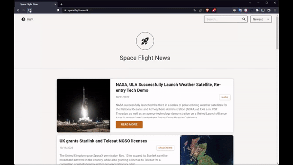

# Frontend Challenge 20210823

<p align="center">
  <a href="https://github.com/lgsfarias/challenge-space-flight-news-20210823">
    
  </a>

  <h3 align="center">
    Space Flight News
  </h3>
  <p align="center">
    Um app para ver as últimas notícias sobre o mundo espacial.
    <br />
    <a href="https://github.com/lgsfarias/challenge-space-flight-news-20210823"><strong>Explore the docs »</strong></a>
    <br />
</p>

<p align="center">
  
</p>

## 🎯 Objetivo

Nesse desafio devo desenvolver uma aplicação web para consumir as informações da API Space Flight News, uma API pública com informações relacionadas a voos espaciais.

<br/>

## ⛏️ Ferramentas utilizadas


<br/>

## 🏁 instruções de instalação

Para rodar este projeto, você precisará instalar [Node.js](https://nodejs.org/en/).

Clone o repositório

```bash
git clone https://github.com/lgsfarias/challenge-space-flight-news-20210823.git
```

Accesse a pasta do projeto

```bash
cd challenge-space-flight-news-20210823
```

Preencha o arquivo .env com as variáveis de ambiente conforme o arquivo .env.example

```bash
cp .env.example .env
```

Instale as dependências

```bash
npm install
# ou
yarn
```

<br/>

## 🏃🏽 Como rodar o projeto

### Rodando o projeto localmente

```bash
npm run dev
# ou
yarn dev
```

### Rodando o projeto com Docker

```bash
npm run dev:docker
# ou
yarn dev:docker
```

A aplicação estará disponível em [http://localhost:3000](http://localhost:3000)

<br/>

## 🧪 Testes

A aplicação possui testes automatizados utilizando o Cypress.

Para rodar os testes, execute o comando:

```bash
npm run cy:run
# ou
yarn cy:run
```

Também é possível rodar os testes utilizando o Cypress abrindo a interface gráfica:

```bash
npm run cy:open
# ou
yarn cy:open
```

<br/>

## 🚀 Produção

Para rodar o projeto em produção será utilizado o Docker com o build do projeto e o nginx para servir o conteúdo estático. Para isso, execute o comando:

```bash
npm run start:docker
# ou
yarn start:docker
```

A aplicação estará disponível em [http://localhost:80](http://localhost:80)

<br/>

## 💻 Deploy

A aplicação está disponível em [https://spaceflightnews.tk/](https://spaceflightnews.tk/)

<br/>

## 📬 Contato

<div>
  <a href="https://www.linkedin.com/in/lgsfarias" target="_blank"></a>
  <a href = "mailto:lgsfarias.dev@gmail.com"></a>
</div>
